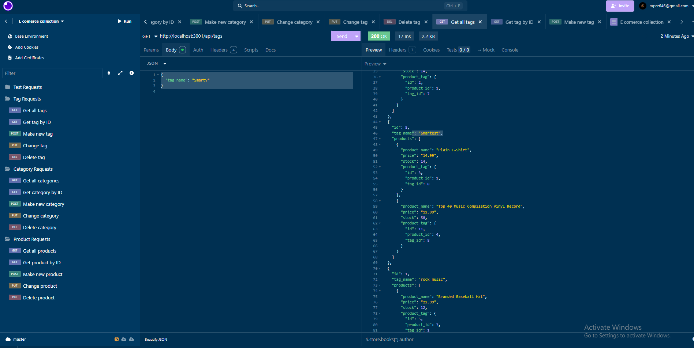

# Employee Tracker

## Table of Contents
- [Description](#description)
- [Installation](#installation)
- [Usage](#usage)
- [Questions](#questions)

## Description
this app is designed to store data of a company which includes storing all product data like products their categories and tags.

https://app.screencastify.com/v3/watch/n4dhPL6hocIuadHVriE7

## Installation
first you must npm i to instal dependencies, next you must log into your pswl and run the schema db, next you npm run seeds to seed your tables, next you npm start to start the server, finally you can use the local host in insomnia to get requests.

## Usage
in a perfect world you would have folders of all the type of requests you want. but you would have to get the url and the right extension like /api/categories and the right route like post or get.

## Questions
For any questions, you can reach me at:
- GitHub: [MIKEYP53](https://github.com/MIKEYP53)
- Email: mprz646@gmail.com
